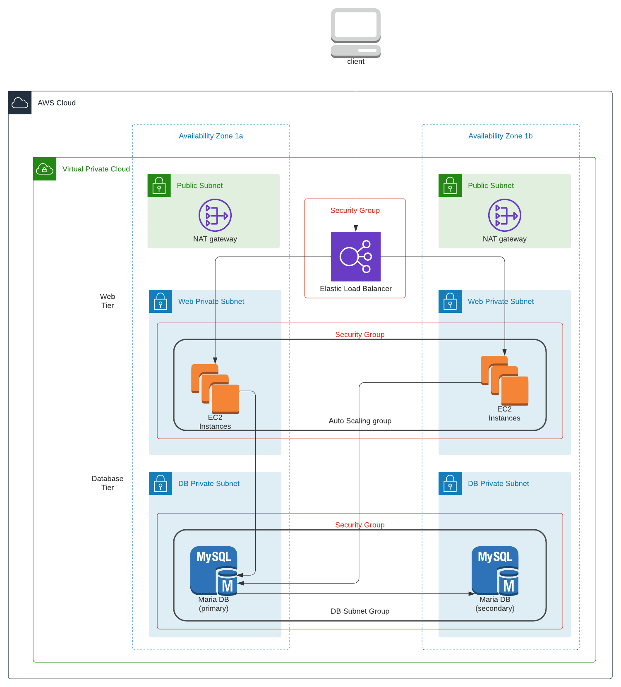

# Challenge 1 - Infrastructure as Code

## Tasks
Symbiosis is a health product manufacturing company and currently on-premises infrastructure. They have recognized the benefits of moving to a cloud infra
structure & would like to evaluate an AWS cloud solution.

Based on their priorities and internal discussions, they have provided you with some high-level requirements which they would like you to implement in the
 proposed solution. The high-level requirements are as follows:

- A private isolated network which would best suit Symbiosis’s 2 tier architecture needs. In order to meet their internal SLAs they require a highly available solution as well.
- Symbiosis being a B2C company, would typically like their web applications to be accessible over the internet and thus handle HTTP traffic. Simple EC2 instance will suffice.
- The database tier should have restricted access (not open to HTTP) and allow traffic only through the web tier.
- They would like to reduce the administrative burden of managing their SQL database and require a managed database for their SQL engine in the proposed solution. They need the database to be highly available.
- Currently they experience medium to high traffic on their network. The traffic to the web tier is managed by a load balancer which diverts traffic to healthy instances. They would ideally like a Load Balancer with an ability to perform layer 4 (Transport Protocol) and layer 7 (Application) checks while balancing the load. There is no requirement at this point to balance the load on the database tier.
- In their current setup, the traffic being inconsistent, requires over provisioning resulting in increased costs. In order to overcome this issue, they would like the new system to allow automatic scaling in the event of a traffic spike.

## Prerequisites
- AWS account and credentials configured and set up.

## Proposed System
<!--  -->

- The system is deployed in 2 Availability Zones and on 2 private subnets 
    - private_subnet (private subnet for web)
    - db_subnet (private subnet for db)
- The EC2 instances are managed by an autoscaling group and the system is accessible from the internet only via the ELB endpoint.
- Only web tier has access to the database tier at the specified port 3306.
- MariaDB SQL database is used as the managed database. It is configured to be highly available on the 2 Availability Zones.
- An Elastic Load Balancer (ELB) is used to divert traffic to healthy instances. ELB health checks are in place to ensure that only instances that respond at layer 7 receive traffic. Cross-Zone load balancing is enabled to improve application availability and resiliency.
- An autoscaling group is in place with a target tracking policy. Average CPU utilization of the Auto Scaling group is the current target. Minimum and maximum scaled instances can be set accordingly.
- The hosted webapp is a sample CRUD application found at [vue-js-node-js-express-mysql] (https://github.com/bezkoder/vue-js-node-js-express-mysql). Its initialization is prepared as a template file in the launch configuration that is utilized by the AutoScaling group.

## Instructions
1. Deploy the system with `terraform init && terraform apply`.
2. Access the webpage at the url provided in the previous step.

## Remarks
- The terraform modules required for all challenges are found at the `common modules` folder found at `../modules`.
- The main configuration file for the deployment (for this challenge1) is at `main.tf` of this folder. This file then references the modules (found at `common modules` folder) that is required for this deployment.
- For this exercise, the variables that have been parameterized for the respective modules are limited. This list of variables can be further expanded where and when required.